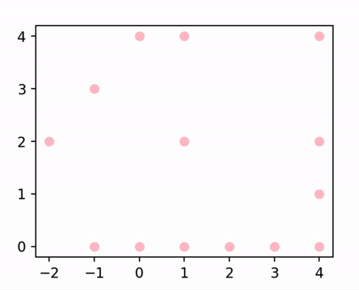
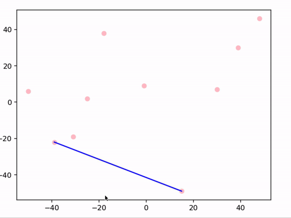
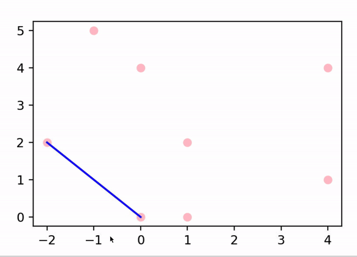
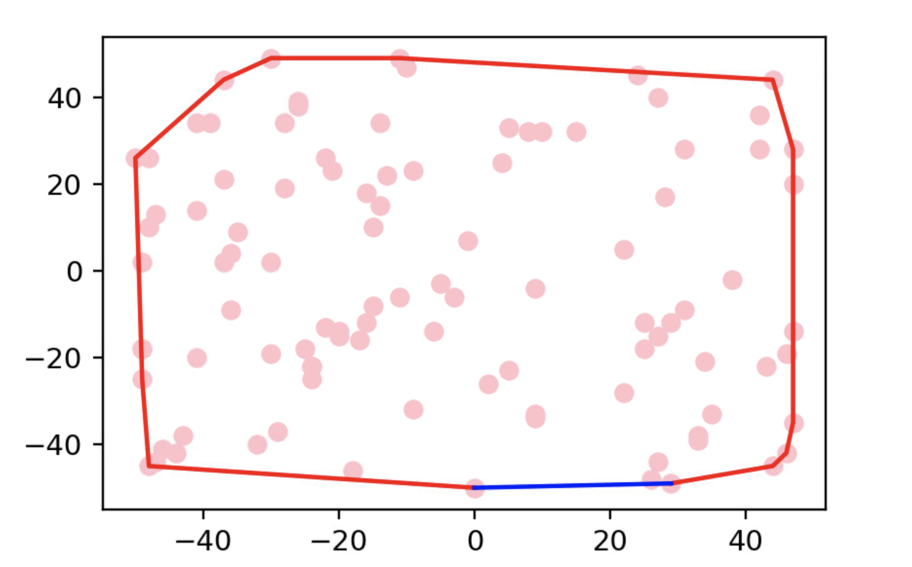

# CSC 274: Graham Animation Project

Yujun Shen, Yanning Tan, Ella Yang, Yutong Zhang

## Introduction

This project is an implementation of the Graham Scan algorithm. It takes in a certain number of randomly generated points and returns the points that are on the hull. 

An animation is also generated to visualize the scanning process via `matplotlib`. 

## Required Python Packages / Modules
- To develop, we used Python 3.8.12.
- `matplotlib` (version 3.5.1)
- `sympy` (version 1.9)
    * 1 dependency: `mpmath`
- `time`
- `random`
- `math`

### Steps for installation:
1. Install mpmath (Instructions found [here](https://github.com/fredrik-johansson/mpmath#1-download--installation))
    * The latest release of mpmath can be downloaded from the mpmath website and from https://github.com/fredrik-johansson/mpmath/releases

    * It should also be available in the Python Package Index at https://pypi.python.org/pypi/mpmath

    * To install the latest release of Mpmath with pip, simply run [in your terminal] 
 
      >`pip install mpmath`

    * Or unpack the mpmath archive and run
    
      >`python setup.py install`

    * Mpmath can also be installed using 
      
      > `python -m easy_install mpmath`

2. Install sympy (Instructions found [here](https://pypi.org/project/sympy/))
    
    * Highly recommended installation through [Anaconda](https://www.anaconda.com/products/individual)

    * To install latest release of sympy with pip, simply run [in your terminal]
    
   > `pip install sympy`

    * You can also download it [here.](https://pypi.org/project/sympy/)

3. Install matplotlib (Instructions found [here.](https://matplotlib.org/stable/users/installing/index.html))
    * To install latest release of Mpmath with pip, simply run [in your terminal]

    > `python -m pip install -U pip`
  
    > `python -m pip install -U matplotlib`

4. Make sure packages are in the same folder as `main.py`!

## How to Run
* In Replit https://replit.com/@ZiyueYang1/Graham-animation#main.py, press the green "Run" button at the top of the screen.
* When running locally on your computer, run the program to see the results in your IDE.

* If using terminal, make sure you are in the same directory of our programs, and then type:
`python3 main.py`. 

## Code walkthrough
   
* Find the bottommost point by finding the point with the smallest y-coordinate in the point set.
    * If there is a tie, choose the point with the smallest x-coordinate.
*  Sort the rest of the points in the list by angles they made with the bottommost (from largest to smallest). `sortedPointList` is returned in a clockwise manner.
    * If  there is a tie, sort by distances they are from the bottommost point.
* Make the bottommost point the first element of the list `pointsOnHull`. 
* Loop through `sortedPointList`, appending points from `sortedPointList` to `pointsOnHull`.
    * To determine whether or not a left turn is made, `isLeftTurn` is used to calculate twice the signed area determined by `pointsOnHull[-1]`, `pointsOnHull[-2]`, `pointsOnHull[-3]`.
    * If a newly added point (`pointsOnHull[-1]`) makes a left turn, pop `pointsOnHull[-2]` as it must not be on the hull. 
* Append the bottommost point at the end of `pointsOnHull` to make the hull complete. 

### Examples of outputs

- Colinear points: `test_1`
  
- Randomly generated 10 points: `test_2`
  
- Points in general positions: `test_3`
  
- Randomly generated 100 points: `test_4`
  - .mov file is also available in the folder
  